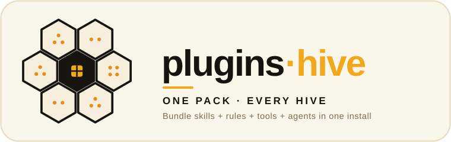

> **Moved.** This hive now lives in
> [werkrbee/ai-hive](https://github.com/werkrbee/ai-hive/tree/main/hives/plugins-hive)
> under `hives/plugins-hive`, where all development happens.
> This repository is archived read-only and keeps the
> history up to the move.

<p align="center">
  
</p>

# plugins-hive

> **One pack, every hive.** Bundle **skills + rules + tools + agents** into a
> single installable pack. One command fans out to all four hives' installers, so
> the whole House ships together.

*Part of the **[ai-hive](https://github.com/werkrbee/ai-hive)** family — werkrbee's House of Hives (skills · rules · tools · agents · and more).*

The **composition** layer of the House of Hives. The four core hives
([skills](https://github.com/werkrbee/skills-hive),
[rules](https://github.com/werkrbee/rules-hive),
[mcp](https://github.com/werkrbee/mcp-hive),
[agents](https://github.com/werkrbee/agents-hive)) are independently useful — but
most of the time you want a curated set of all of them at once. A **pack** is that
curated set, and this installer wires the House together in one shot.

## Packs

| Pack | What it bundles |
|------|-----------------|
| [**werkrbee-core**](packs/werkrbee-core/pack.json) | Barry + Patricia (skills), the Queen Bee's Charter (rules), filesystem/git/fetch (tools), and the review fleet — explore, code-review, security-review, charter-review (agents) |

A pack is a small `pack.json` manifest naming which artifacts from each hive to
install, and for which harnesses:

```json
{
  "name": "werkrbee-core",
  "harnesses": ["claude-code", "cursor", "github-copilot"],
  "skills": ["barry", "patricia"],
  "rules": ["queen-charter"],
  "mcp": ["filesystem", "git", "fetch"],
  "agents": ["explore", "code-review", "security-review", "charter-review"]
}
```

## Repository layout

```text
plugins-hive/
├── packs/
│   └── werkrbee-core/pack.json   # a curated bundle across all four hives
├── scripts/
│   └── install.py                # fan out one pack to every hive's installer
├── LICENSE
└── README.md
```

Unlike the four core hives, plugins-hive has **no `adapters/` tree** — it holds no
harness-specific artifacts of its own. It *composes* the hives, which each carry
their own harness support. (Fewer patterns forced where they don't fit.)

## Install

The installer resolves the sibling hive repos and calls each hive's own installer.
It looks for the hives in `./hives/` (git submodules) first, then beside
plugins-hive; override with `--hives-dir`.

```bash
git clone https://github.com/werkrbee/plugins-hive.git
cd plugins-hive

# See exactly what will run, no changes made
python3 scripts/install.py werkrbee-core --dry-run --dir /path/to/project

# Install the whole pack into a project (rules/tools/agents) + globally (skills)
python3 scripts/install.py werkrbee-core --dir /path/to/project

# If the hives live elsewhere
python3 scripts/install.py werkrbee-core --dir /path/to/project --hives-dir ~/Projects
```

One run installs, for each harness in the pack:

- **skills** → global skills dirs (`~/.claude/skills`, …)
- **rules** → the project's instruction files (`CLAUDE.md`, `.cursor/rules/…`, …)
- **mcp** → the project's MCP configs (`.mcp.json`, `.cursor/mcp.json`, …)
- **agents** → the project's agent files (`.claude/agents/…`, chatmodes, …)

Skills install globally (they're reusable capabilities); rules, tools, and agents
install into the target project — matching how each hive is normally scoped.

## Getting the hives

Easiest is the [ai-hive](https://github.com/werkrbee/ai-hive) one-clone setup
(submodules), or clone the four hives beside this repo:

```bash
git clone https://github.com/werkrbee/skills-hive.git
git clone https://github.com/werkrbee/rules-hive.git
git clone https://github.com/werkrbee/mcp-hive.git
git clone https://github.com/werkrbee/agents-hive.git
git clone https://github.com/werkrbee/plugins-hive.git
```

## Adding a pack

1. Create `packs/<name>/pack.json` with `harnesses` and any of `skills`, `rules`,
   `mcp`, `agents` (arrays of artifact names).
2. Update the packs table above.
3. Install it: `python3 scripts/install.py <name> --dir /path/to/project`.

## License

MIT — see [LICENSE](LICENSE).
